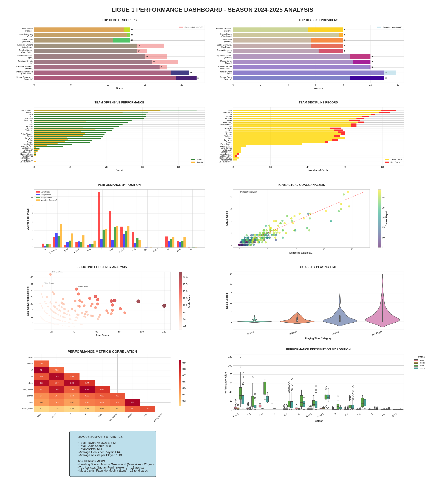

# European Top 5 Leagues Dashboard Analysis (2014-2025)


## Overview

This project provides a comprehensive, interactive dashboard for analyzing the last 10 seasons (2014-2015 to 2024-2025) of the top five European football leagues. The dashboard leverages advanced data analytics and visualization techniques to deliver key insights for players, teams, and positions using Python and modern visualization libraries.

## Features

- **League Support:** Analyse Ligue 1, Premier League, La Liga, Bundesliga, and Serie A.
- **Seasonal Comparison:** Easily switch between seasons from 2014-2015 to 2024-2025.
- **Interactive Dashboard:** Professionally structured dashboard summarizing each season's statistics.
- **Advanced Metrics:** Includes xG/xA over/underperformance, goal conversion rates, discipline, and more.
- **Player, Team, and Position Insights:** Top scorers, assisters, efficient teams, performance by position, and discipline records.
- **Correlation Analysis:** Heatmaps showing relationships between key performance metrics.
- **Custom Visualizations:** Violin plots, boxplots, scatter plots, heatmaps, and summary tables.

## Example Output



*Figure: Example dashboard for Ligue 1, season 2024-2025.*

## Installation

1. **Clone the repository:**
   ```bash
   git clone https://github.com/maghous/top5-leagues-dashboard.git
   cd top5-leagues-dashboard
   ```

2. **Install dependencies:**
   ```bash
   pip install pandas numpy matplotlib seaborn
   ```

3. **Prepare your data:**
   - Ensure your league datasets are in CSV or DataFrame format and include at least the following columns:
     - `player_name`, `team_title`, `games`, `goals`, `assists`, `shots`, `xG`, `xA`, `key_passes`, `time`, `yellow_cards`, `red_cards`, `position`
   - Example:
     ```python
     import pandas as pd
     df_ligue1_24_25 = pd.read_csv('ligue1_2024_2025.csv')
     ```

## Usage

```python
from dashboard import Ligue1Dashboard

# Example for Ligue 1 - 2024/2025 season
dashboard = Ligue1Dashboard(df_ligue1_24_25, saison='2024-2025', ligue='Ligue 1')
fig = dashboard.create_dashboard()
fig.savefig('dashboard_2024_2025.png')
```

- To automate dashboards for multiple seasons/leagues, use a loop:

```python
seasons = [
    ('14_15', '2014-2015'),
    ('15_16', '2015-2016'),
    ...
    ('24_25', '2024-2025'),
]
for code, saison in seasons:
    df = globals()[f'df_ligue1_{code}']  # or load from CSV
    dashboard = Ligue1Dashboard(df, saison=saison, ligue='Ligue 1')
    fig = dashboard.create_dashboard()
    fig.savefig(f'dashboard_ligue1_{saison}.png')
```

## Dashboard Components

- **Top 10 Goal Scorers & Assisters:** Compare actual vs expected (xG/xA).
- **Team Performance:** Aggregate team stats for goals and assists.
- **Discipline:** Yellow/red card records per team.
- **Position Analysis:** Average performance metrics by player position.
- **xG Analysis:** Scatter of expected vs actual goals.
- **Efficiency:** Goal conversion scatter for top shooters.
- **Playing Time:** Violin plots of goals by playing time category.
- **Metric Correlations:** Heatmap of feature correlations.
- **Performance Distribution:** Boxplots for goals, assists, and more by position.
- **Summary Table:** Season highlights and top performers.

## Sample Insights Generated

- Who is the top scorer and overperformer relative to xG?
- Which team is the most efficient in converting chances?
- What position contributed the most goals?
- Who received the most cards in the league?

## Customization

- You can easily adapt the dashboard to other leagues/competitions by changing the input data and league name.
- Add or modify plots in the `Ligue1Dashboard` class to suit your analysis needs.

## Contributing

Contributions are welcome! Please open an issue or submit a pull request for improvements, new features, or bug fixes.

## License

[MIT License](LICENSE)

## Acknowledgements

- Data sources:[Understat](https://understat.com/)
- Visualization inspiration: [Seaborn](https://seaborn.pydata.org/), [Matplotlib](https://matplotlib.org/)

---

> *Empowering football fans, analysts, and clubs with data-driven insights across Europe’s elite leagues!*
